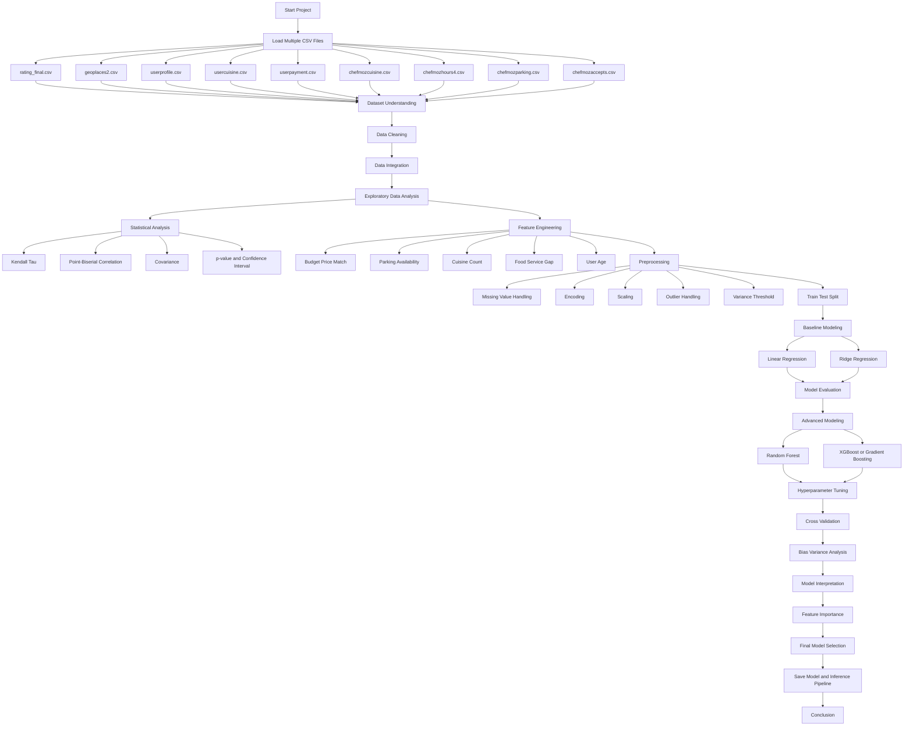

# Project Overview

## Restaurant Intelligence System using Consumer Ratings Dataset

Project ini bertujuan untuk membangun sistem analisis dan prediksi rating restoran berdasarkan data rating konsumen, profil pengguna, informasi restoran, jenis makanan, metode pembayaran, jam operasional, dan fasilitas parkir.

Dataset yang digunakan adalah **Restaurant Data with Consumer Ratings** dari Kaggle/UCI. Dataset ini terdiri dari beberapa file CSV yang saling berhubungan melalui dua key utama, yaitu:

```text
userID
placeID
```

Secara umum, project ini tidak hanya berfokus pada prediksi rating, tetapi juga diarahkan menjadi mini sistem **Restaurant Intelligence System** yang dapat menjawab beberapa pertanyaan penting:

```text
1. Faktor apa saja yang memengaruhi rating restoran?
2. Apakah harga, pelayanan, jenis makanan, parkir, dan profil user berpengaruh terhadap rating?
3. Apakah model machine learning dapat memprediksi rating restoran secara akurat?
4. Apakah restoran dapat diklasifikasikan sebagai low, medium, atau high rating?
5. Apakah data ini dapat digunakan sebagai dasar sistem rekomendasi restoran?
6. Bagaimana performa model sebelum dan sesudah optimasi?
```

---

# 1. Background

Rating restoran merupakan salah satu indikator penting dalam memahami kualitas pengalaman konsumen. Rating tidak hanya dipengaruhi oleh makanan, tetapi juga dapat dipengaruhi oleh pelayanan, harga, aksesibilitas, suasana restoran, fasilitas parkir, jenis makanan, metode pembayaran, serta karakteristik pengguna.

Dataset ini menarik karena terdiri dari banyak tabel yang merepresentasikan dua sisi utama:

```text
1. Restaurant-side features
   Informasi restoran, lokasi, harga, cuisine, parkir, jam buka, metode pembayaran.

2. User-side features
   Profil pengguna seperti preferensi makanan, budget, kebiasaan, transportasi, dan gaya hidup.

3. Interaction-side features
   Rating yang diberikan user terhadap restoran tertentu.
```

Karena itu, dataset ini cocok untuk membangun project yang menggabungkan pendekatan **Data Science** dan **Machine Learning Engineering**.

---

# 2. Problem Statement

Masalah utama dalam project ini adalah memahami dan memprediksi rating restoran berdasarkan kombinasi data restoran, data pengguna, dan data interaksi rating.

Secara lebih spesifik, project ini memiliki beberapa problem:

```text
1. Rating restoran tidak hanya dipengaruhi oleh satu faktor.
2. Dataset terdiri dari banyak file sehingga membutuhkan proses data integration.
3. Banyak fitur berbentuk kategorikal sehingga perlu encoding yang tepat.
4. Beberapa fitur perlu dibuat ulang melalui feature engineering.
5. Model sederhana perlu dibandingkan dengan model yang lebih kompleks.
6. Evaluasi harus melihat kemungkinan overfitting dan underfitting.
7. Hasil model harus dapat dijelaskan, bukan hanya menghasilkan skor akurasi.
```

---

# 3. Main Objective

Tujuan utama project ini adalah membangun model machine learning untuk memprediksi dan menganalisis rating restoran berdasarkan data konsumen dan restoran.

Target awal project:

```text
Memprediksi rating restoran menggunakan algoritma manual:
1. Linear Regression
2. Ridge Regression
```

Target pengembangan project:

```text
Mengoptimasi performa model dengan menambahkan algoritma:
3. Random Forest
4. XGBoost / Gradient Boosting
```

Selain itu, project ini juga akan digunakan untuk mempelajari konsep statistik, feature engineering, evaluasi model, dan interpretasi model.

---

# 4. Machine Learning Task

Project ini dapat dikembangkan menjadi beberapa task machine learning.

## 4.1 Regression Task

Task utama:

```text
Memprediksi nilai rating restoran.
```

Target:

```text
rating
```

Contoh algoritma:

```text
Linear Regression
Ridge Regression
Random Forest Regressor
XGBoost Regressor / Gradient Boosting Regressor
```

Evaluasi:

```text
MAE
MSE
RMSE
R2 Score
Cross Validation Score
Bias-Variance Analysis
```

---

## 4.2 Classification Task

Rating dapat diubah menjadi kategori:

```text
0 = Low Rating
1 = Medium Rating
2 = High Rating
```

Contoh aturan:

```text
rating 0 -> Low
rating 1 -> Medium
rating 2 -> High
```

Atau menggunakan threshold berdasarkan distribusi data.

Contoh algoritma:

```text
Logistic Regression
Random Forest Classifier
XGBoost Classifier
Support Vector Machine
```

Evaluasi:

```text
Accuracy
Precision
Recall
F1 Score
Confusion Matrix
Classification Report
```

---

## 4.3 Recommendation System Task

Dataset ini juga dapat digunakan sebagai dasar sistem rekomendasi sederhana karena memiliki relasi:

```text
userID
placeID
rating
```

Pendekatan rekomendasi:

```text
1. Popularity-based recommendation
2. Content-based recommendation
3. User preference matching
4. Collaborative filtering sederhana
```

Output:

```text
Top-N restaurant recommendation untuk user tertentu.
```

---

# 5. Dataset Description

Dataset terdiri dari beberapa file CSV:

```text
rating_final.csv
geoplaces2.csv
userprofile.csv
usercuisine.csv
userpayment.csv
chefmozcuisine.csv
chefmozhours4.csv
chefmozparking.csv
chefmozaccepts.csv
```

Deskripsi umum:

```text
rating_final.csv       -> data rating user terhadap restoran
geoplaces2.csv         -> informasi detail restoran
userprofile.csv        -> profil pengguna
usercuisine.csv        -> preferensi cuisine pengguna
userpayment.csv        -> metode pembayaran pengguna
chefmozcuisine.csv     -> jenis cuisine restoran
chefmozhours4.csv      -> jam operasional restoran
chefmozparking.csv     -> informasi parkir restoran
chefmozaccepts.csv     -> metode pembayaran yang diterima restoran
```

Key relasi utama:

```text
userID  -> menghubungkan rating dengan user profile
placeID -> menghubungkan rating dengan restaurant profile
```

---

# 6. Feature Plan

Karena dataset asli tidak selalu menyediakan fitur seperti cleanliness score, promo, halal, atau distance secara langsung, maka beberapa fitur harus diambil dari dataset asli dan beberapa lainnya dibuat melalui feature engineering.

## 6.1 Original Features

Contoh fitur dari sisi rating:

```text
rating
food_rating
service_rating
```

Contoh fitur dari sisi restoran:

```text
placeID
name
city
state
country
latitude
longitude
alcohol
smoking_area
dress_code
accessibility
price
url
Rambience
franchise
area
other_services
```

Contoh fitur dari sisi user:

```text
userID
smoker
drink_level
dress_preference
ambience
transport
marital_status
birth_year
interest
personality
activity
color
weight
budget
height
```

Contoh fitur tambahan dari file lain:

```text
cuisine
parking_lot
payment_method
hours
days
```

---

## 6.2 Engineered Features

Beberapa fitur tambahan dapat dibuat untuk memperkaya analisis:

```text
user_age
restaurant_has_parking
restaurant_accepts_card
restaurant_cuisine_count
user_cuisine_count
is_user_budget_match_restaurant_price
service_food_gap
average_food_service_rating
is_weekend_open
is_alcohol_available
is_smoking_allowed
distance_from_user_to_restaurant
```

Catatan:

```text
distance_from_user_to_restaurant hanya dapat dibuat jika koordinat user dan restoran tersedia.
Jika koordinat user tidak tersedia, fitur distance tidak digunakan.
```

---

# 7. Target Variable

Target utama untuk regression:

```text
rating
```

Target tambahan:

```text
food_rating
service_rating
```

Target classification:

```text
rating_category
```

Contoh mapping:

```text
0 -> Low Rating
1 -> Medium Rating
2 -> High Rating
```

---

# 8. Statistical Analysis Topics

Project ini juga digunakan untuk mempelajari konsep statistik berikut:

```text
Kendall Tau Correlation
Point-Biserial Correlation
Covariance
Variance Threshold
IQR Outlier Detection
p-value
Confidence Interval
Gaussian Log-Likelihood
Bias-Variance Analysis
```

Penerapan:

```text
Kendall Tau
Digunakan untuk melihat hubungan ordinal antara fitur seperti price, budget, food_rating, service_rating, dan rating.

Point-Biserial Correlation
Digunakan untuk melihat hubungan antara fitur binary dan rating, misalnya parking_available terhadap rating.

Covariance
Digunakan untuk melihat arah hubungan antar fitur numerik seperti food_rating, service_rating, dan rating.

Variance Threshold
Digunakan untuk menghapus fitur yang memiliki variasi terlalu kecil.

IQR Outlier Detection
Digunakan untuk mendeteksi outlier pada fitur numerik seperti age, weight, height, atau engineered feature lainnya.

p-value
Digunakan untuk menguji apakah fitur tertentu memiliki hubungan signifikan terhadap target.

Confidence Interval
Digunakan untuk mengestimasi rentang kepercayaan rata-rata rating atau performa model.

Gaussian Log-Likelihood
Digunakan untuk memahami seberapa baik asumsi error model regression mengikuti distribusi Gaussian.

Bias-Variance Analysis
Digunakan untuk membandingkan apakah model terlalu sederhana atau terlalu kompleks.
```

---

# 9. Algorithm Plan

Project dimulai dari algoritma manual sederhana, lalu dikembangkan ke algoritma yang lebih kompleks.

## 9.1 Manual Baseline Algorithms

```text
1. Linear Regression
2. Ridge Regression
```

Alasan:

```text
Linear Regression digunakan sebagai baseline karena sederhana dan mudah diinterpretasikan.
Ridge Regression digunakan untuk mengurangi overfitting dengan regularization.
```

---

## 9.2 Optimized Algorithms

```text
3. Random Forest Regressor
4. XGBoost Regressor / Gradient Boosting Regressor
```

Alasan:

```text
Random Forest dapat menangkap hubungan non-linear dan interaksi antar fitur.
XGBoost atau Gradient Boosting dapat meningkatkan performa melalui sequential boosting.
```

---

## 9.3 Optional Classification Algorithms

Jika target rating diubah menjadi kategori:

```text
1. Logistic Regression
2. Random Forest Classifier
3. XGBoost Classifier
4. Support Vector Machine
```

---

# 10. Experiment Design

Eksperimen dilakukan secara bertahap:

```text
Experiment 1:
Baseline menggunakan fitur rating_final saja.

Experiment 2:
Menggabungkan rating_final dengan geoplaces2.

Experiment 3:
Menggabungkan rating_final, geoplaces2, dan userprofile.

Experiment 4:
Menambahkan cuisine, parking, payment, dan hours.

Experiment 5:
Menambahkan feature engineering.

Experiment 6:
Membandingkan Linear Regression, Ridge Regression, Random Forest, dan XGBoost.

Experiment 7:
Melakukan hyperparameter tuning.

Experiment 8:
Melakukan interpretasi model dan error analysis.
```

---

# 11. Evaluation Metrics

Untuk regression:

```text
MAE
MSE
RMSE
R2 Score
Cross Validation Mean Score
Cross Validation Standard Deviation
```

Untuk classification:

```text
Accuracy
Precision
Recall
F1 Score
Confusion Matrix
Classification Report
```

Untuk recommendation:

```text
Precision@K
Recall@K
Mean Rating of Recommended Items
Coverage
```

---

# 12. Expected Output

Output utama project:

```text
1. Dataset gabungan yang bersih.
2. Analisis statistik hubungan antar fitur.
3. Visualisasi distribusi rating dan fitur penting.
4. Model baseline Linear Regression.
5. Model Ridge Regression.
6. Model Random Forest.
7. Model XGBoost / Gradient Boosting.
8. Perbandingan performa semua model.
9. Analisis overfitting dan underfitting.
10. Feature importance.
11. Kesimpulan faktor yang paling memengaruhi rating restoran.
12. Pipeline inference sederhana untuk prediksi rating restoran baru.
```

---

# 13. Project Workflow



---

# 14. Learning Outcomes

Setelah menyelesaikan project ini, kemampuan yang diharapkan meningkat adalah:

```text
1. Memahami cara membaca banyak dataset CSV.
2. Memahami relasi antar tabel menggunakan userID dan placeID.
3. Melakukan dataset understanding secara sistematis.
4. Melakukan EDA pada data numerik dan kategorikal.
5. Melakukan data integration dari banyak sumber.
6. Melakukan feature engineering berbasis domain.
7. Menggunakan korelasi statistik untuk analisis fitur.
8. Membangun baseline model regression secara manual.
9. Mengembangkan model ke algoritma yang lebih kompleks.
10. Melakukan K-Fold Cross Validation.
11. Melakukan Hyperparameter Tuning.
12. Menganalisis overfitting dan underfitting.
13. Menginterpretasikan feature importance.
14. Membuat pipeline inference sederhana.
15. Menyiapkan project agar lebih dekat ke workflow Data Scientist dan ML Engineer.
```

---

# 15. Final Project Direction

Project ini diarahkan menjadi project gabungan antara:

```text
Data Science:
- EDA
- Statistical analysis
- Feature engineering
- Model comparison
- Model interpretation

Machine Learning:
- Regression
- Classification
- Recommendation system
- Hyperparameter tuning
- Cross validation

Machine Learning Engineering:
- Clean pipeline
- Saved model
- Inference function
- Reusable preprocessing
- Experiment tracking sederhana
```

Dengan struktur ini, project tidak hanya menjadi latihan prediksi rating restoran, tetapi juga menjadi portfolio project yang menunjukkan kemampuan end-to-end dalam membangun sistem machine learning berbasis data nyata.
